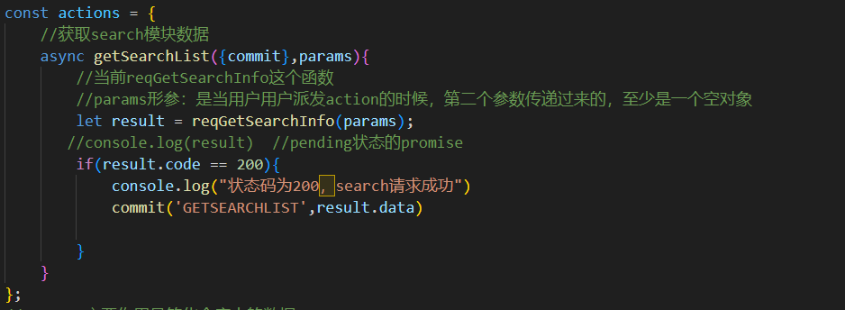
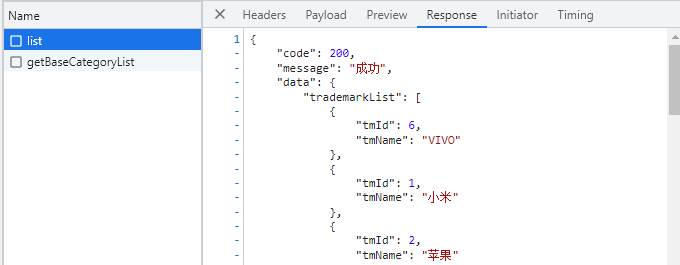
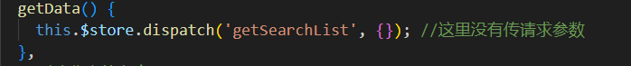

# 尚品汇项目笔记

#### 1. 除了导入设定样式之外，有时候还需要清除原有样式。

reset.css

#### 2. vue2、vue3 混用报错

vue2 对应 vue-router3，vue3 对应 vue-router4  
 项目用的是 vue2，电脑上安装的是 vue3，用`npm i vue@2.7.5`进行版本降级  
 

#### 3. less 样式

项目中使用 less 样式，浏览器无法识别 less 样式，需要转成 css 样式，要安装 vue2 对应版本的 less 和 less-loader  
 为了增加 css 熟练度，我直接用 css 样式。

#### 4. 路由传递参数面试题

(1) 路由传递参数（对象写法）path 是否可以结合 params 参数一起使用？
<u>路由跳转传参的时候，对象的写法可以是 name、path 形式，但是需要注意的是 path 不能和 params 一起用。</u>  
(2) 如何指定 params 参数可传可不传?  
 <u>如果路由要求传递 params 参数，但是不传递 params 参数，URL 会出现问题，因为 params 占位了。</u>  
 <u>指定 params 参数可传可不传的方法：在配置路由的时候，在占位的后面加上一个问号，表示 params 可以传递或者不传。</u>  
(3) params 参数如果传递的是空串，如何解决？
使用 undefined 解决

```javascript
this.$router.push({name:'search',params:{keyword:''||undefined},query:{k:this.keyword.toUpperCase()})
```

(4) 路由组件能不能传递 props 数据?
路由组件可以传递 props 数据。  
 布尔值写法 ：`props:true`
对象写法：额外的给组件传递一些 props
函数写法：可以给 params 参数、query 参数通过 props 传递给路由组件

#### 5. 编程式导航由跳转到当前路由（参数不变），多次执行会抛出 NavigationDuplicated 警告错误？

> 路由跳转有两种形式：声明式导航、编程式导航
> 编程式导航出现警告错误，是因为新版的 vue-router 引入了 promise

> 通过给 push 方法传递相应的成功、失败的回调函数，可以捕获到当前错误，但> 是这种方法治标不治本。

> this.\$router 是 VueRouter 类的一个实例，当在入口文件注册路由的时候，给组件实例添加\$router 和\$route 属性
> push：VueRouter 原型对象上的方法
> 重写 VueRouter 原型对象上的 push 方法

```javascript
function VueRouter() {}
//原型对象的方法
VueRouter.prototype.push = function () {
  //函数的上下文为VueRouter类的一个实例
};
let $router = new VueRouter();
$router.push(xx);
this.$router.push();
```

#### 6. Home 模板组件拆分

-- 先把静态页面完成
-- 拆出静态组件
-- 获取服务器的数据进行展示
-- 动态业务

#### 7. 三级联动

-- 由于三级联动在 Home、Search、Detail 出现，把三级联动注册为全局组件。
好处：只需要注册一次，就可以在项目任意地方使用。

#### 8. 路径引用

./ 当前目录下
../ 父级目录下
@/ webpack 设置的路径别名，一般代表 src 文件夹的路径

#### 9. HTML 结构和 CSS 样式

-- nav 标签 导航菜单
-- 居中效果 `display: flex;`、`margin:auto`
-- 导航栏靠左`position:absolute`，指定`left`、`top`
-- z-index 指定盒子在当前堆叠上下文中的堆叠层级，z-index 较大的元素会覆盖较小的元素在上层进行显示

-- 静态页面布局有点乱，swiper 样式没有引入，public 文件夹下的 index.html 是干嘛的

#### 10. postman、apipost 测试接口

http://gmall-h5-api.atguigu.cn/api/product/getBaseCategoryList

#### 11. axios 二次封装

请求拦截器：在发请求之前处理一些业务
响应拦截器：当服务器数据返回后，可以处理一些事情

#### 12. 接口统一管理

项目很小：完全可以在组件的生命周期函数中发请求
项目大：axios.get('xxx')
<mark>P18 网络请求没有发送成功？不太明白 api 文件夹下 index.js 和 request.js 的作用</mark>

#### 13. 跨域问题

跨域：协议、域名、端口号不同 发请求
前端：http://localhost:8080/#/home
后端：http://gmall-h5-api.atguigu.cn
解决：JSONP、CROS、代理

#### 14. nprogress 进度条的使用

start done 样式可以修改

#### 15. vuex 状态管理库

vuex 是官方提供的一个插件，状态管理库，集中式管理项目组件中共同的数据。
state、mutations、actions、getters、modules


#### 16. vuex 实现模块式开发

每个模块存储自己的数据，Vuex 允许将 store 分割成模块。

mapstate 没有理解

#### 17. 动态展示三级联动数据

从接口获取数据，写到页面并渲染

1）完成一级分类动态添加背景颜色
第一种解决方案：采用样式完成 ：hover
第二种解决方案：设置一个 curIndex，鼠标放到上面时，记录当前 index 值，设置 curIndex==index 时生效的样式:class="{cur:currentIndex==index}，事件委派。

#### 18. 通过 js 控制二三级分类

在二级分类外的 div 加上 `：style="{display:currentIndex==index?'block':'none'}"`

#### 19. 防抖和节流（面试手撕）

正常：事件触发非常频繁，而且每一次的触发，回调函数都要去执行。
防抖(debounce)：前面的所有触发都被取消，最后一次执行在规定的时间之后才会被触发，也就是说如果连续快速的触发，只会执行一次。（事件被打断就要重新开始）
节流(throttle)：在规定的间隔时间范围内不会重复触发回调，只有大于这个时间间隔才会触发回调，把频繁触发变为少量触发。（上次事件完成才能执行下次事件）
用户操作太快，导致浏览器反应不过来，如果当前回调函数中有一些大量业务，有可能出现卡顿现象。

> lodash 插件：封装了函数的防抖和节流的业务【闭包+延迟器】

#### 20. 三级联动路由跳转与传递参数

三级联动用户可以点击的：一级分类、二级分类，当点击的时候，Home 模块跳转到 Search 模块，一级会把用户选中的产品在路由跳转的时候进行传递。

路由跳转
声明式导航：router-link
编程式导航：push|replace

声明式导航为什么出现卡顿？ 第 27 集有分析 <router-link>是组件，耗内存

编程式导航+事件委派 实现路由跳转与传递参数
事件委派：利用事件冒泡，将里层元素需要响应的事件绑定到外层元素。

event.target，节点有个 dataset 属性，可以获取自定义属性
自定义属性 :data-categoryName :data-categoryId 利用自定义属性区分是什么标签和几级路由

怎样整理路由参数和跳转，路由编程式导航相关的内容不太熟

#### 21. Search 组件中 TypeNav 部分的隐藏和显示

利用 v-show，在需要隐藏的地方加上显示的条件。设置鼠标进入和鼠标离开事件，判断$route.path 是否是 search，并判断 v-show 的状态。
<mark>出现的问题：一级分类的背景色样式不见了</mark>
<mark>问题：过渡动画不生效，<transition>标签 reference 引用不到设置过渡效果的元素</mark>

#### 22.

TypeNaV 每次执行 mounted 里面的派发 action 都会请求数据，为了改进性能在 APP.vue 中只派发一次 action 获取数据。

#### 23.合并 query 和 params 参数

#### 24.开发 home 首页当中的 ListContainer

mock 数据（模拟）：mock.js 插件，生成随机数据，拦截 Ajax 请求
使用步骤：1）在 src 下创建 mock 文件夹
2）准备 json 数据
3）
4）

#### 25. swiper 插件

第一步：引入相应依赖包
第二步：页面中的结构务必要有
第三步：初始化 swiper 实例，给轮播图添加动态效果

watch + nextTick：监听已有数据的变化
// nextTick:在下次 DOM 更新循环结束之后执行延迟回调。在修改数据之后立即使用这个方法，获取更新后的 DOM。

轮播图图片出不来：
scr 前面少了一个: v-bind 缩写，单向数据绑定
swiper 前进后退效果不生效：Navigation 下的 nextEl 和 preEl 写错了

#### 26. mock+vuex

1）写请求，调用封装好的 api
2）vuex，把 actions、mutations、state 写好

#### 27. floor 组件获取数据

v-for 可以在组件标签中使用

#### 28. 组建通信的方式有哪些

props:父子组件通信
自定义事件：@on @emit 可以实现子给父通信
全局事件总线：$bus 全能
pub sub-js：vue 中几乎不用
插槽
vuex


#### 29. 在对floor组件进行渲染时报错


遍历的时候key写错了，应该是遍历项的id，数组没有Id属性，数组中的对象有id属性


#### 30. search模块开发

1）写静态页面+静态页面拆分出来

2）发请求

3）vuex

4）组件获取仓库数据，动态展示数据


#### 31. 面包屑

1）动态开发面包屑中的分类名

编程式导航路由跳转【自己跳自己】

2）动态开发面包屑里的关键字

当面包屑中的关键字清除以后，需要让兄弟组件Header组件中的关键字清除（全局事件总线）


#### 32. 自定义事件（子组件向父组件通信）

品牌属性请求数据、展示、面包屑、删除+重新请求（第50集最好重新做）

#### 33. 商品详情页
a. 将详情页的组件注册为路由组件
在Search组件中，点击商品图片时，跳转到详情页面，在路由跳转的时候带上产品的ID给详情页面
滚动行为，跳转或刷新页面，页面回到指定位置
b. API请求接口
c. vuex，获取产品详情信息
vuex中还需新增一个模块detail

发送请求时没发现是模板字符串写法
用postman请求商品详情数据没问题，但是在项目中，由于search数据空的，没有点击商品，无法派发请求获取到数据，
Search模块请求在chrome调试工具中没问题，但是在vuex中是空的
在search的action中reqGetSearchInfo打印出来是个pending状态的Promise，没有返回成功状态码200
    在action里派发reqGetSearchInfo请求，没有请求成功
  chrome调试工具中network有list请求，可以看到响应数据
<<<<<<< HEAD
   

派发action的时候没有携带请求参数只携带了空对象，post请求至少是一个空对象
找到原因：在获取search模块数据的时候，少写了个await。不写await，post请求返回的Promise对象，状态码是undefined。写了await之后，post请求返回正常数据，状态码是200，在状态码200的情况下进行vuex进一步操作。  （这里可以写一篇博客！！)


#### 34. url改变，页面不跳转

点击商品，url改变，但是页面也没跳转到商品详情，需要再次刷新

#### 35. 分页器问题

 第一次点击页码，反应正常，第二次点击反应不正常

=======
   派发action的时候没有携带请求参数只携带了空对象，post请求至少是一个空对象
找到原因：在获取search模块数据的时候，少写了个await。不写await，post请求返回的Promise对象，状态码是undefined。写了await之后，post请求返回正常数据，状态码是200，在状态码200的情况下进行vuex进一步操作。  （这里可以写一篇博客！！）
>>>>>>> df49c36 (电商网站，商品首页、商品搜索、商品详情页)
